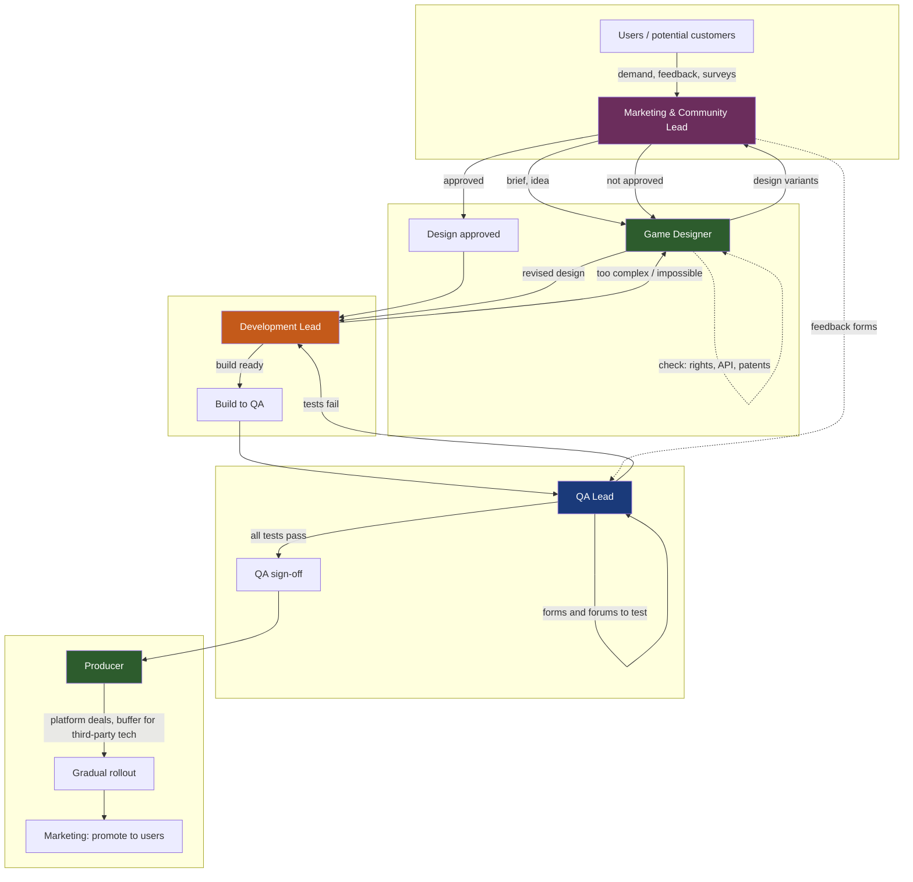

# Workflow: From User Demand to Release

Process diagram across roles (Marketing & Community Lead → Game Designer → Development Lead → QA Lead → Producer).

## Steps in short

1. **Marketing & Community Lead** discovers user demand (surveys, feedback, popular gamers) and brings the idea to the **Game Designer**.
2. **Game Designer** produces design variants and checks rights/API/patents. Nothing moves forward until **Marketing approves**.
3. Approved design goes to **Development Lead**. If something is impossible or too complex to implement, it goes back to the designer to change the design.
4. The build goes to **QA Lead**. QA tests the game and the feedback forms/forums from marketing. When tests fail, they report to the developer until all tests pass.
5. After QA sign-off, the **Producer** negotiates with platforms, plans with buffer for third-party risks, and runs **gradual rollout** (not to all users at once).
6. **Marketing & Community Lead** promotes the game to users.
