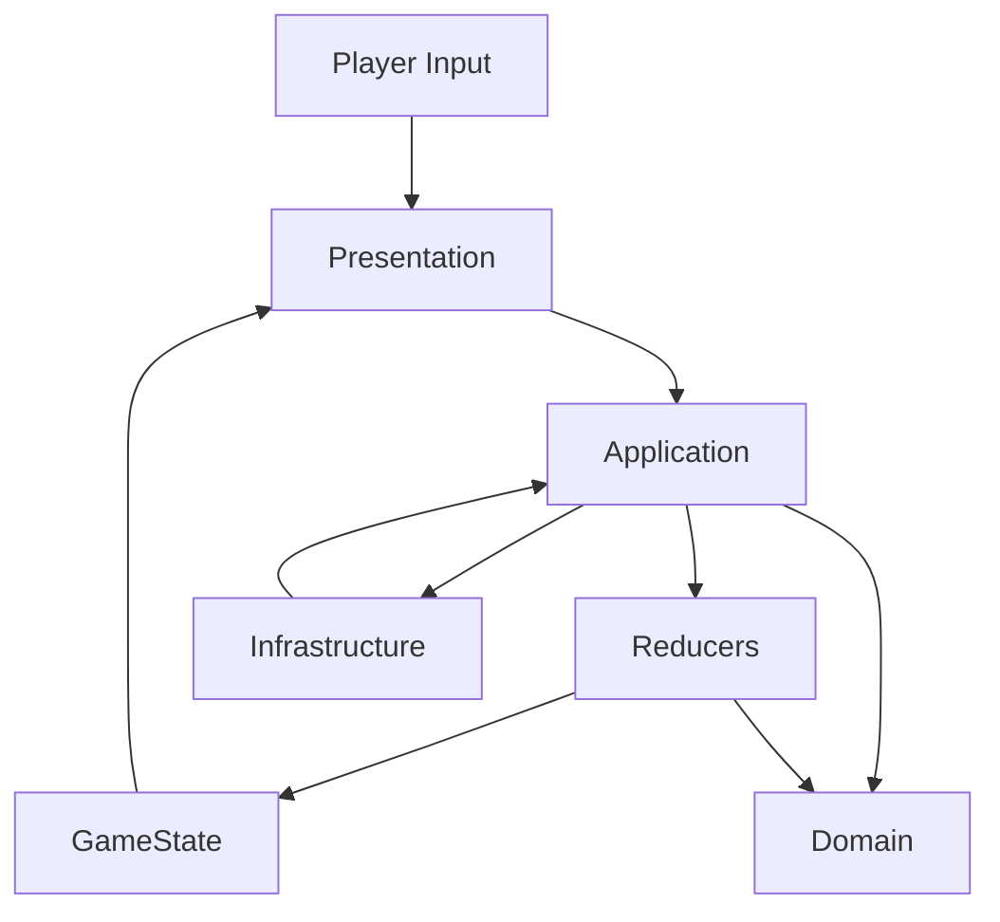

## Core (well known architecture design)

### Target architecture 

We use **MVU / Reactive** (close to **Redux**) as the main architecture for the web game (Phaser 3), because it:
- makes data flow explicit (actions → reducer → state → view),
- allows strict review rules to prevent “wrong” changes,
- scales from a single `game.js` to a multi-file codebase without changing the mental model.

**Layers**

- **Domain (pure, no Phaser, no DOM)**
  - Entities/Value Objects: `Commission`, `Room`, `PlacedItem`, `ShopItem`, `Money`
  - Rules: validation, completion check, rewards, placement constraints (grid/walls)
  - Deterministic pure functions only
- **Application (use-cases / orchestration)**
  - Action creators / commands: “accept commission”, “place item”, “move item”, “remove item”, “buy item”, “submit”
  - Reducer(s): update `GameState`
  - Services interfaces: `Storage`, `Telemetry`, `Random`, `Clock`
- **Presentation (Phaser Scenes + DOM UI)**
  - `BriefingScene`, `DesignScene`, `ShopScene` are *views/controllers*:
    - they **render** based on state
    - they **dispatch actions** on user input
  - DOM panel (`#ui-panel`) is a view that is driven from state
- **Infrastructure (side effects)**
  - persistence (localStorage), assets loading, analytics, error reporting
  - adapters that implement service interfaces

**Boundaries**
- Domain MUST NOT import/use Phaser/DOM/localStorage/network.
- Presentation MUST NOT implement game rules (“is completed?” / “reward?” / “what items are required?”) — it only dispatches actions and renders state.
- Infrastructure MUST NOT contain rules; it only does I/O and maps to/from Domain/Application shapes.

**State model (single source of truth)**

`GameState` owns everything needed to render:
- current scene (“briefing”, “design”, “shop”)
- currency
- current level / room template id
- current commission
- placed items list (including wall side, grid size, texture key)
- occupancy grid (derived or stored, but updates must be consistent)
- purchased shop items
- last submission result (success/failure) and feedback message

**Actions**
- `CommissionAccepted`
- `ItemPlaced`
- `ItemMoved`
- `ItemRemoved`
- `ItemPurchased`
- `SubmitRequested`
- `SubmitResolved(success|failure)`
- `LevelAdvanced`

**Reducer rules**
- Reducers are pure: `(state, action) => newState`
- No random/time inside reducers (inject `Random`/`Clock` via Application before dispatch or via explicit action payload)

**Why not MVC/MVP here**
- Phaser Scenes already behave like controllers; MVC often ends up hiding mutations across many objects.
- MVU makes review strict: every change must be represented as an action and a reducer diff.

**Optional evolution path**
- If the simulation becomes heavy (hundreds/thousands of items), we can move runtime logic to a **hybrid ECS** (systems operate on component arrays) while keeping MVU for UI/state transitions.

---

## Data flow mermaid diagram



---

## Examples for your language or pseudocode

### 1) Domain: commission completion (pure)

```js
// domain/commission.js
export function isCommissionCompleted(commission, placedItems) {
  const hasAllAdds = commission.requiredAdd.every((req) =>
    placedItems.some((it) => it.name.toLowerCase().includes(req.toLowerCase()))
  );

  const hasNoRemovals = !placedItems.some((it) =>
    commission.requiredRemove.some((req) =>
      it.name.toLowerCase().includes(req.toLowerCase())
    )
  );

  return hasAllAdds && hasNoRemovals;
}
```

### 2) Application: submit use-case (orchestrates + dispatches)

```js
// app/submitCommission.js
export function submitCommission({ state, dispatch, domain }) {
  dispatch({ type: "SubmitRequested" });

  const ok = domain.isCommissionCompleted(state.commission, state.placedItems);

  dispatch({ type: "SubmitResolved", payload: { ok } });
  if (ok) dispatch({ type: "LevelAdvanced" });
}
```

### 3) Reducer: strict state transitions (no side effects)

```js
// app/reducer.js
export function reducer(state, action) {
  switch (action.type) {
    case "ItemRemoved": {
      const id = action.payload.id;
      return {
        ...state,
        placedItems: state.placedItems.filter((x) => x.id !== id),
      };
    }

    case "SubmitResolved": {
      const ok = action.payload.ok;
      return {
        ...state,
        lastResult: ok ? "success" : "failure",
        currency: ok ? state.currency + state.commission.reward : state.currency,
      };
    }

    default:
      return state;
  }
}
```

### 4) Presentation: Scene dispatches actions, renders from state

```js
// presentation/designScene.js (sketch)
doneButton.onclick = () => dispatch({ type: "SubmitRequested" });

// rendering happens by reading current state
briefText.innerText = state.commission.brief;
coinsText.innerText = `Coins: ${state.currency}`;
```

---

## Review guidelines

These rules are **strict**. A PR is rejected if **any** item below is violated.

### Architecture compliance (hard fail)
- **Single source of truth**: All game data that affects rendering MUST live in `GameState`. No “hidden state” inside Scenes, DOM nodes, or random globals.
- **Unidirectional data flow**: UI/Scenes MUST NOT mutate state directly. They MUST only `dispatch(action)`.
- **Pure domain/reducers**: Domain functions and reducers MUST be referentially transparent (no I/O, no `Date.now()`, no randomness, no DOM, no Phaser).
- **No rule duplication**: Any rule (commission completion, economy, placement constraints) MUST exist in exactly one place: Domain. Copy-pasted logic in Scenes is a rejection.
- **No cross-layer imports**:
  - Domain cannot import Presentation/Infrastructure.
  - Presentation cannot import Infrastructure directly (only through Application ports).
- **No ad-hoc globals**: adding new global mutable variables (like `let currency = 0`) is forbidden. Existing ones must be treated as legacy and not expanded.

### Architectural smell examples (hard fail)
- **Model inside view**: any business rule implemented directly in a Scene/DOM handler (e.g. checking commission completion in `DesignScene`) instead of Domain is rejected.
- **State spread across views**: storing authoritative game data in multiple Scenes or DOM nodes (instead of `GameState`) is forbidden.
- **Cross-layer leaks**: calling Phaser APIs or touching DOM from reducers/domain functions is not allowed.
- **Tight coupling**: Scenes importing each other’s internals instead of working through actions/state is rejected.

### Architecture evolution discipline (hard fail)
- New features MUST extend existing layers (Domain / Application / Presentation / Infrastructure), not introduce ad-hoc shortcuts.
- Any change that alters boundaries between layers MUST be reflected in this document.

