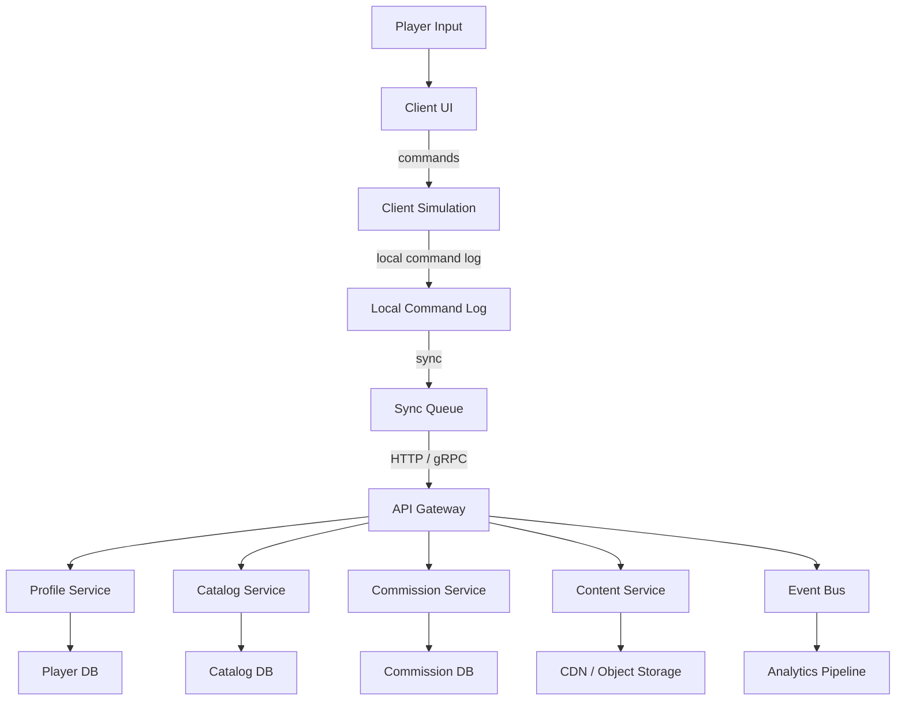

## Core (well known architecture design)

### What changes if this is a huge project

Assume:
- millions of players,
- thousands of rooms/templates,
- tens of thousands of furniture assets,
- huge databases (catalog, economy, personalization, live ops),
- multiple teams working in parallel,
- strict performance budgets.

The “small project” MVU/Redux approach remains useful for UI orchestration, but we introduce **clear sub-systems** and more scalable runtime patterns.

**High-level split**

- **Client**
  - Presentation: UI, input, rendering
  - Runtime simulation: placement, snapping, collisions, constraints
  - Offline cache + sync queue
  - Telemetry + crash reporting
- **Backend**
  - Catalog service (furniture/sets/pricing)
  - Player profile service (inventory, unlocks, currency)
  - Commission service (generation, balancing, AB tests)
  - Content service (room templates, seasonal content)
  - Payment service (if monetization exists)
  - Moderation/UGC service (if players can share rooms)
  - Analytics pipeline
- **Data**
  - OLTP DB for player state (sharded)
  - Cache (Redis-like) for hot reads
  - CDN/object storage for assets
  - OLAP warehouse for analytics

**Client architecture**

- **MVU for UI**, but state is split:
  - `UIState` (menus, overlays, tool selection)
  - `SessionState` (current room instance, active commission)
  - `SimulationState` (placement/occupancy, spatial indexing)
- **Hybrid ECS for simulation** (optional but recommended):
  - Entities: items/placements/decals
  - Components: `Transform`, `Renderable`, `GridFootprint`, `Surface`, `Selectable`
  - Systems: snapping, overlap resolution, wall constraints, serialization
- **Immutable snapshots** for undo/redo, plus **command log** for replay:
  - commands are persisted locally and can be synced
  - deterministic replay enables debugging and anti-cheat

**Backend architecture**

- **CQRS** where needed:
  - commands update player state
  - queries read from optimized projections/caches
- **Event-driven** for live ops:
  - “commission completed”, “item purchased”, “room shared”
  - downstream consumers: analytics, achievements, notifications
- **Versioned contracts**
  - strict schemas (JSON schema / protobuf) with backward compatibility
  - migrations are mandatory

**Data storage**

- Player state:
  - store as normalized tables or document records with strict schema versioning
  - keep “source of truth” minimal; derive projections for UI
- Catalog:
  - immutable versions + release channels (prod/staging/seasonal)
- Assets:
  - CDN, hashed filenames, manifest with dependency graph

**Performance & reliability**

- Client:
  - asset streaming + LOD for large catalogs
  - spatial indexing (grid chunks / quadtrees)
  - memory budget enforcement; texture atlases
- Backend:
  - rate limiting, idempotency keys, retries
  - circuit breakers for dependencies
  - caching strategy and invalidation plan

---

## Data flow mermaid diagram



---

## Examples for your language or pseudocode

### 1) Command log (client) for deterministic replay

```js
// command example
{
  id: "cmd_01H...",
  type: "PlaceItem",
  ts: 1710000000000,
  payload: { roomInstanceId, itemCatalogId, surface: "left", gridX: 4, gridY: 5 }
}
```

### 2) Idempotent backend endpoint (sketch)

```pseudo
POST /v1/commands
Headers:
  Idempotency-Key: <uuid>

Server:
  if key already processed -> return previous result
  validate schema version
  apply command transactionally
  emit events
  return new profile snapshot version
```

### 3) ECS system example (placement constraint)

```pseudo
System WallPlacementSystem:
  for each entity with (Transform, GridFootprint, Surface=Wall):
    clamp to wall bounds
    reject overlaps using wall occupancy index
```

---

## Review guidelines

These rules are **stricter** than the small project. A PR is rejected on any violation.

### Architecture & contracts (hard fail)
- **No breaking API changes** without:
  - version bump,
  - backward compatibility strategy,
  - migration plan,
  - rollout plan (staged).
- **Schema-first**: every payload is validated against a versioned schema; unvalidated JSON is forbidden.
- **Client/Server separation**: client cannot be the source of truth for currency/inventory/completion; server authoritatively validates.
- **Event compatibility**: event names and payload fields are immutable once released; only additive changes allowed.

### Architectural smell examples (hard fail)
- **Business logic in edge services**: gateway or controller implementing game rules instead of delegating to domain/service layer.
- **Cross-service data ownership**: two services treating the same aggregate (e.g. currency) as their source of truth.
- **Chatty client–server protocols**: UI flows requiring many small synchronous calls instead of coarse-grained operations.
- **Unbounded dependencies**: a service directly calling “random other” services without a clear dependency graph or contracts.

